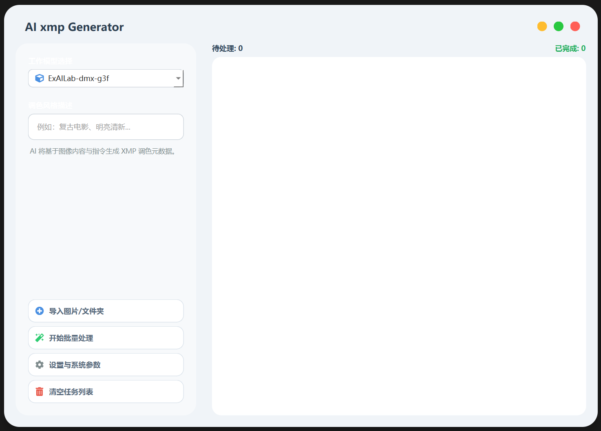
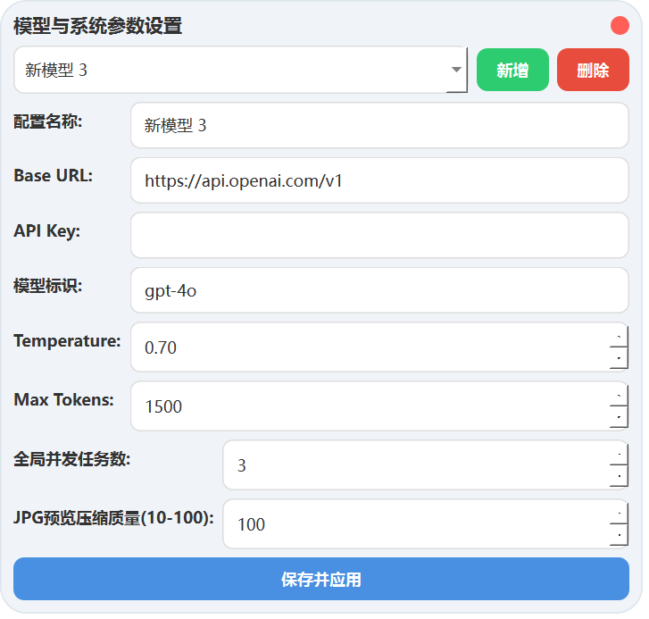

# AI XMP Generator 📸


**AI XMP Generator** 是一款基于人工智能的<span style="color:green"> RAW </span>摄影<span style="color:red">后期预处理</span>辅助工具。它能够通过深度分析 RAW 图片的内容与元数据，结合用户给出的风格指令（如“电影感”、“复古胶片”、“明亮清新”），自动生成适用于 Adobe Camera Raw (ACR) 和 Lightroom 的 `.xmp` 调色预设文件。

> **告别繁琐的参数调整，让 AI 成为你的<span style="color:red">后期预处理</span>助理。**

---

## 🖼️ 界面预览





---

## ✨ 功能特性

-   **智能影像分析**：利用 Gemini-3-flash 等多模态大模型分析图片曝光、色彩倾向及构图。
-   **全参数覆盖**：自动生成包括基本色调、HSL、颜色分级、点曲线（R/G/B）、相机校准、去雾等全套 ACR 参数。
-   **批量处理**：支持多线程并发处理，一次性导入整个文件夹。
-   **多模型支持**：兼容 OpenAI API 格式的所有模型（如 GPT-4o, Claude 3.5, 或国内兼容接口）。
-   **EXIF 信息继承**：自动读取 RAW 文件的拍摄参数（ISO、快门、光圈、镜头信息）辅助 AI 判断。
-   **完全自定义**：支持用户输入风格描述词，精准引导 AI 的调色方向。

---

## 🛠️ 安装要求

### 环境要求
-   Python 3.8 或更高版本
-   操作系统：Windows / macOS / Linux

### 安装依赖包

在终端或命令提示符中运行以下命令安装必要的 Python 库：

```bash
pip install PyQt6 rawpy Pillow requests exifread qtawesome
```

---

## 🚀 快速开始

1.  **运行程序**：
    ```bash
    python main.py
    ```

2.  **配置 API**：
    -   点击界面左侧的 **“设置与系统参数”** 按钮。
    -   添加你的 AI 模型配置：
        -   **Base URL**: 例如 `https://api.openai.com/v1`
        -   **API Key**: 填入你的密钥。
        -   **模型标识**: 例如 `gpt-4o`。
    -   点击“保存并应用”。

3.  **导入图片**：
    -   点击 **“导入图片/文件夹”**，选择你的 RAW 格式文件（支持 `.NEF`,`.DNG`,`.CR3`,`.ARW`, `.CR2`,   `.RAF` 等）。

4.  **输入需求**：
    -   在 **“调色风格描述”** 框中输入你想要的风格。例如：*“清冷的日系电影感，低饱和度，高光微蓝”*。

5.  **生成**：
    -   点击 **“开始批量处理”**。完成后，`.xmp` 文件将自动生成在 RAW 图片所在的同级目录下。

6.  **应用到照片**：
    -   打开 Photoshop 的 Adobe Camera Raw 或 Lightroom，这些设置将自动关联或通过“载入设置”应用。

---

## ⚙️ 系统架构

该工具的工作流程如下：
1.  **解析**：使用 `rawpy` 提取 RAW 预览图，`exifread` 提取拍摄元数据。
2.  **第一步 AI 诊断**：将缩略图与元数据发送给 AI，获取专业的后期诊断与风格建议。
3.  **第二步 参数转换**：将 AI 的自然语言建议转换为标准的 XMP JSON 格式数据。
4.  **生成**：将 JSON 数据注入内置的 XMP 模板，写入磁盘。

---

## ⚠️ 注意事项

-   **API 消耗**：处理一张图片会调用两次 API（一次分析图片，一次生成 JSON），请注意你的 Token 使用情况（实际使用国内服务商的gemini-3-flash-preview处理，大约0，08元一张）。
-   **图片隐私**：本工具会上传一张经过压缩和缩放的临时 JPG 预览图（默认质量 80，长边 1024px）到 AI 服务器进行视觉分析。
-   **RAW 兼容性**：支持大多数主流相机厂商的 RAW 格式，若遇到无法读取的文件，请尝试转换为 `.DNG`。


## 🤝 贡献与反馈

欢迎提交 Issue 或 Pull Request 来改进本项目！
-   如果 AI 生成的参数不理想，可以尝试在 `main.py` 中修改 `step1_prompt`。
-   如果发现某些相机格式的 EXIF 无法读取，请提交相关文件样本。

---

**如果这个项目对你有帮助，欢迎点一个 ⭐ Star！**